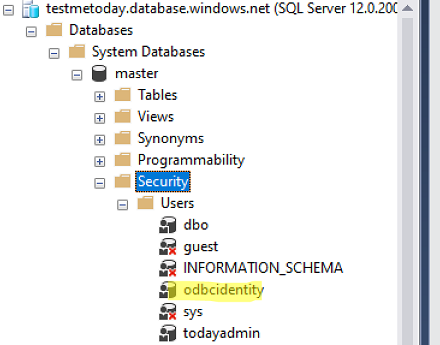

# MSI Auth with Azure Managed Identity

- Create MI and assign to PodIdentity or VM
- Assign Managed Identity to SQL Admin (or Group) 

```
az sql server ad-admin create --display-name odbcidentity --object-id <MI objectid> --resource-group aks-tests --server testmetoday    
{
  "id": "/subscriptions/xxxxx/resourceGroups/aks-tests/providers/Microsoft.Sql/servers/testmetoday/administratorOperationResults/ActiveDirectory",
  "location": "West Central US",
  "login": "odbcidentity",
  "name": "ActiveDirectory",
  "resourceGroup": "aks-tests",
  "sid": "xxx",
  "tenantId": "xxx",
  "type": "Microsoft.Sql/servers/administrators"
}
```
After creation verify that identity was added automatically to `master` database users



- set connection string in the `application.properties` with 1authentication=ActiveDirectoryMSI;msiClientId=<MI id>`
```
spring.datasource.url=jdbc:sqlserver://testmetoday.database.windows.net:1433;database=testae;authentication=ActiveDirectoryMSI;msiClientId=<MI app id>;Encrypt=true;TrustServerCertificate=false;HostNameInCertificate=*.database.windows.net;loginTimeout=30
```

- build and run
```
mvn package -DskipTests=true
java -jar target/sqlmsi-0.0.1-SNAPSHOT.jar 
```

it will print logged in User
```
ationTaskExecutor'
2020-04-07 21:15:34.757  INFO 2725 --- [           main] o.s.b.w.embedded.tomcat.TomcatWebServer  : Tomcat started on port(s): 8080 (http) with context path ''
2020-04-07 21:15:34.759  INFO 2725 --- [           main] com.msft.sqlmsi.SqlmsiApplication        : Started SqlmsiApplication in 6.823 seconds (JVM running for 7.392)
You have successfully logged on as: e8e422cc-2bb7-xxxx-xxxx-cff38b07a026@72f988bf-86f1-41af-91ab-2d7cd011db47
```
